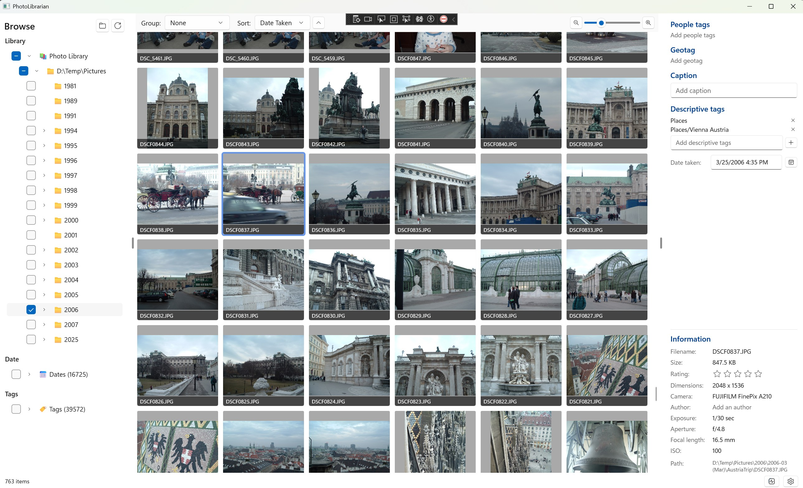

#  PhotoLibrarian

A fast, strictly local (no cloud service) photo library manager for Windows — built with WinUI 3 and Win2D.

PhotoLibrarian is designed to handle real photo libraries (tens of thousands of images, including RAW + video) without lock-up, with a single-purpose UI inspired by the late, well-loved **Windows Live Photo Gallery**. Unlike other solutions out there with hidden databases or local web servers, this is purely a local app. Nothing hidden or ties to a cloud service. Your photos and data stay on your computer.



> **Premise:** your edits stay with your images.
> Ratings, captions, tags, and capture dates are written **directly into the image file** using Windows Imaging Component, so moving a photo to another drive, computer, or app keeps every edit intact. No proprietary catalog, no parasitic sidecars (for the formats that can hold their own metadata).

---

## Highlights

- 🚀 **Custom virtualized grid** that handles 18 000+ items per folder smoothly. No `ItemsRepeater` layout cycles, no per-item bindings — just a `Canvas` with a recycled element pool.
- 🗂️ **Windows-style folder tree** with multi-checkbox selection plus parallel **Date** and **Tag** trees; the three sections combine as a union filter.
- 🏷️ **Hierarchical tags** (`people/family/kids` indexes `people` + `people/family` + `people/family/kids` so you can filter at any level).
- ⚡ **SQLite metadata index** + Windows native thumbnail cache for instant viewport-aware loads.
- ✏️ **Multi-select metadata panel** — rating, caption, tags, and capture date all edit *every* selected image at once, with "(n of m)" hints when values differ and a date-shift mode for time-zone fix-ups.
- 🎨 **Win2D real-time editor** with Exposure / Brightness / Contrast / Highlights / Shadows / Saturation / Temperature / Tint / Clarity / Sharpness / Levels / Rotation.
- 💾 **In-place metadata writing** for JPEG / TIFF / PNG / HEIC / JPEG-XR via `BitmapEncoder.CreateForInPlacePropertyEncodingAsync` — image bytes are preserved exactly; only the metadata block is rewritten. RAW formats (CR2/CR3/NEF/ARW) fall back to XMP sidecars (industry-standard limitation).
- 🔍 **Background indexing** with restartable re-index and a manage-folders dialog.

---

## Status

Active personal project — usable for daily browsing, tagging, and rating today. See [Roadmap](#roadmap) for what's missing relative to Windows Live Photo Gallery.

---

## Architecture

```
┌───────────────────────────────────────────────────────────────┐
│  PhotoLibrarian            (WinUI 3 app, Win2D, MVVM)         │
│  ┌─────────────────┬──────────────────┬────────────────────┐  │
│  │  FolderNav      │   ImageGrid      │   MetadataPanel    │  │
│  │  (Library/      │   (custom virt.  │   (multi-select    │  │
│  │   Date/Tag      │    Canvas grid)  │    aware editor)   │  │
│  │   trees,        │                  │                    │  │
│  │   union filter) │   ImageViewer    │   ImageEditor      │  │
│  │                 │   overlay        │   (Win2D)          │  │
│  └─────────────────┴──────────────────┴────────────────────┘  │
└───────────────┬───────────────────────────────────────────────┘
                │
┌───────────────▼───────────────────────────────────────────────┐
│  PhotoLibrarian.Core        (services + data layer)           │
│  • EmbeddedMetadataWriter   – in-place EXIF/XMP via WIC       │
│  • MetadataWriter / Reader  – rating, caption, date, tags     │
│  • FolderScannerService     – fast directory walk             │
│  • LibraryIndexingService   – background indexer              │
│  • ThumbnailService         – Windows shell thumbnail cache   │
│  • CacheDatabase            – SQLite metadata cache           │
│  • ImageEditService         – Win2D effect graph application  │
└───────────────────────────────────────────────────────────────┘
                │
┌───────────────▼───────────────────────────────────────────────┐
│  PhotoLibrarian.ML          (face detection, scene tagging)   │
│  • ONNX Runtime + DirectML                                    │
└───────────────────────────────────────────────────────────────┘
```

### Solution layout

| Project | Purpose |
|---|---|
| `src/PhotoLibrarian` | WinUI 3 application (views, viewmodels, controls). |
| `src/PhotoLibrarian.Core` | Services, repositories, models. No UI dependencies (other than WIC). |
| `src/PhotoLibrarian.ML` | ML pipelines (face detection, scene tagging) via ONNX Runtime. |
| `src/PhotoLibrarian.Tests` | xUnit + Moq test suite. |

---

## Metadata-handling philosophy

PhotoLibrarian writes metadata in this priority order so your photos remain portable:

1. **Embedded in the image file** (preferred) — using `Windows.Graphics.Imaging.BitmapEncoder.CreateForInPlacePropertyEncodingAsync`. The image bytes are preserved exactly; only the metadata block changes. Field mappings:
   - **Rating** → `System.Rating` + `System.SimpleRating` (XMP `xmp:Rating` + EXIF RatingPercent)
   - **Caption** → `System.Title` + `System.Comment` (XMP `dc:description` + EXIF XPTitle/XPComment + IPTC)
   - **Tags** → `System.Keywords` (XMP `dc:subject` + EXIF XPKeywords + IPTC Keywords)
   - **Date taken** → `System.Photo.DateTaken` (EXIF DateTimeOriginal)
2. **XMP sidecar** (`*.xmp`) — only for RAW formats that can't be safely rewritten. Lightroom does the same.
3. **SQLite cache** at `%LOCALAPPDATA%\PhotoLibrarian\cache.db` — cache only; never authoritative. Wipe and re-index any time.

Move a JPEG to another drive or another machine and every edit goes with it.

---

## Build & run

### Prerequisites

- **Windows 10 1809** or newer (WinUI 3 requirement).
- **.NET 8 SDK** with Windows targeting pack (`net8.0-windows10.0.22621.0`).
- **Visual Studio 2022** 17.10+ with the *Windows App SDK C# Templates* component, or just `dotnet` CLI.

### From the command line

```powershell
git clone https://github.com/dunclaw/PhotoLibrarian.git
cd PhotoLibrarian
dotnet build src/PhotoLibrarian/PhotoLibrarian.csproj -c Release
dotnet run --project src/PhotoLibrarian/PhotoLibrarian.csproj -c Release
```

### From Visual Studio

Open `PhotoLibrarian.slnx`, set **PhotoLibrarian** as the startup project, pick the **x64** platform, and hit F5.

### First run

1. Click the gear icon → **Manage folders** and add the root(s) you want to index.
2. The background indexer populates the cache; the grid starts filling as soon as the first folder's metadata is ready.

---

## Keyboard & mouse

| Action | Shortcut |
|---|---|
| Select item | Click |
| Range select | Shift+Click |
| Toggle item in selection | Ctrl+Click |
| Open viewer | Double-click |
| Pan/zoom viewer | Mouse wheel (zooms around cursor) |
| Next / previous in viewer | ←  →  arrow keys |

More shortcuts (Ctrl+A, Del, F2, 0-5 rating, F11 slideshow) coming — see the roadmap.

---

## Roadmap

Tracked against a Windows Live Photo Gallery feature inventory (40 items).

### Done ✅
Library nav (folder/date/tag) · grid virtualization · viewer with smooth zoom · multi-select metadata panel · ratings · captions · tags · capture-date edit (set or shift) · in-place metadata writing · Win2D adjustments editor · background indexing.

### Next up
1. **Crop tool** with aspect-ratio presets
2. **Batch rename** with patterns
3. Editor **Prev/Next** + **Make a copy**
4. Standard **keyboard shortcuts** pass
5. **Find & filter**: rating filter, flagged filter, text search (SQLite FTS5)

### Later
Red-eye · effects gallery · histogram · face detection & people tags · geotag map · slideshow themes · print templates · auto-import from camera · batch resize/export.

---

## Contributing

This is a personal project but PRs are welcome. Please keep changes scoped, run the existing build (`dotnet build`), and follow the existing style — small files, clear separation between `Core` services and UI viewmodels.

---

## License

[MIT](LICENSE) © 2026 Duncan Lawler

---

## Acknowledgements

- **Windows Live Photo Gallery** — RIP. The reference UX target.
- [MetadataExtractor](https://github.com/drewnoakes/metadata-extractor-dotnet), [XmpCore](https://github.com/drewnoakes/xmp-core-dotnet), [Win2D](https://github.com/microsoft/Win2D), and the [Community Toolkit MVVM](https://github.com/CommunityToolkit/dotnet) libraries do a lot of heavy lifting.
